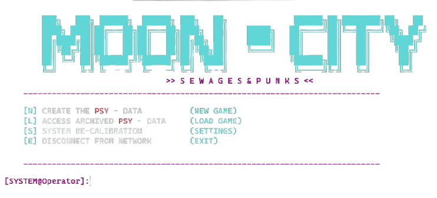

# 🕹️ Sewages&Punks: Консольная игра подземелье

>[!NOTE]
>### Проект представляет собой процедурно-генерируемый Dungeon Crawler в CLI интерфейсе, вдохновленный эстетикой киберпанка.

  

### 🛠 Архитектура проекта

Нажмите, чтобы развернуть описание

    Проект разделен на логические модули для удобства расширения:

    src/core.py — ядро игры, механики перемещения, взаимодействия и боя.
    src/businesslogic_*.py — скрипты для генерации карты и игровой логики.
    src/display.py — визуализация интерфейса.
    src/entities.py — описание игрока и противников.
    src/localization.py — текстовые ресурсы.
    src/constants.py — константы.
    pregen_levels/ — заранее созданные не сгенерированные уровни.

         
### ✅ Реализовано: 

Нажмите, чтобы развернуть описание

- [x] Procedural Generation: Генерация случайных уровней.
- [x] Survival System: Здоровье, ловушки (с механикой разминирования), сундуки.
- [x] Combat System: Пошаговые сражения с врагами.
- [x] Game States: Главное меню, система сохранений/загрузки прогресса.
- [x] Exits: Ключи и двери для выхода из секторов и генерации новых.
- [x] Immersive: Вступление и сцена окончания игры.
    

### 🎮 Как запустить
Для работы игры в исходном виде (через код) вам понадобится установленный Python 3.10 или выше.

Нажмите, чтобы развернуть описание
 Download ZIP и распаковать его.

Шаг 2. Переход в директорию проекта
        
    В терминале перейдите в папку, где лежит файл main.py:

    cd Sewages-Punks
        

Шаг 3. Создание виртуального окружения
        
    Рекомендуется использовать виртуальное окружение, 
    чтобы зависимости проекта не конфликтовали с системными:

    
    Для Windows:
        
        1. python -m venv venv
        2. venv\Scripts\activate

    Для Linux / macOS(Внимание! Возможна некорректная работа. Игра разрабатывалась под Windows):
        
        1. python3 -m venv venv
        2. source venv/bin/activate

Шаг 4. Запуск игры

    Запустите главный файл скрипта:

        Для Windows:
        python main.py

        Для Linux / macOS(Внимание! Возможна некорректная работа. Игра разрабатывалась под Windows):
        python3 main.py

### 🗺 Дорожная карта (Roadmap)

Нажмите, чтобы развернуть описание

### 📥 Скачать

>[!TIP]
>[📥 Скачать .exe файл(Стабильная версия)](https://pixeldrain.com/u/ArfuYE55)

>[!TIP]
>[📥 Скачать .exe файл(Старая версия)](https://pixeldrain.com/u/uUn6ncTY)

### 📄 Лицензия

Распространяется под лицензией MIT. Подробнее см. в файле [LICENSE](LICENSE).

### 💻 Разработчик

**Safonov Nikita Sergeevich** 

Связаться со мной — iceghostse@gmail.com
